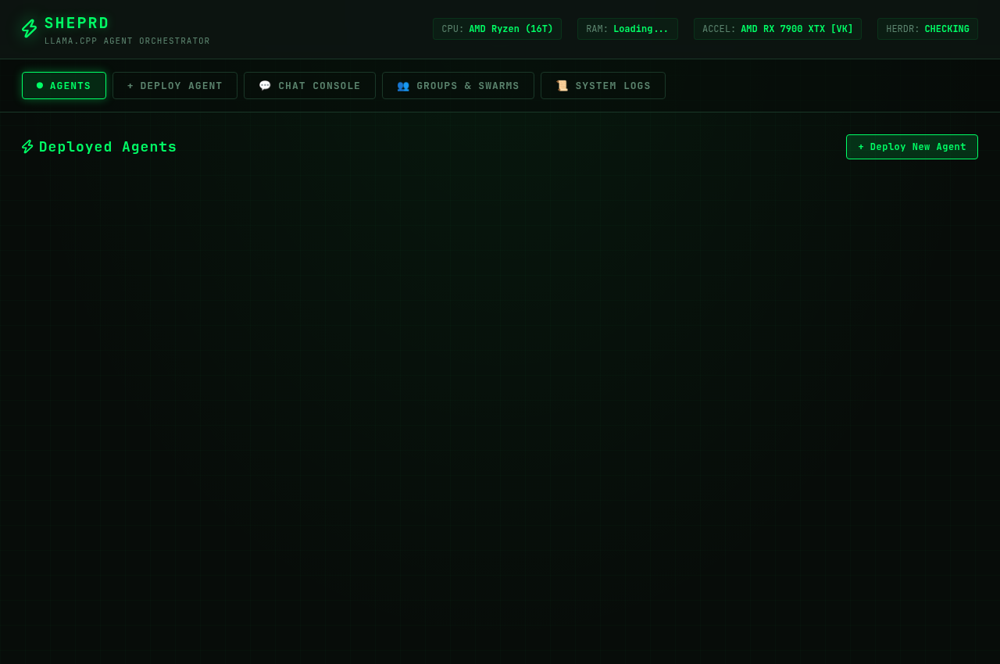
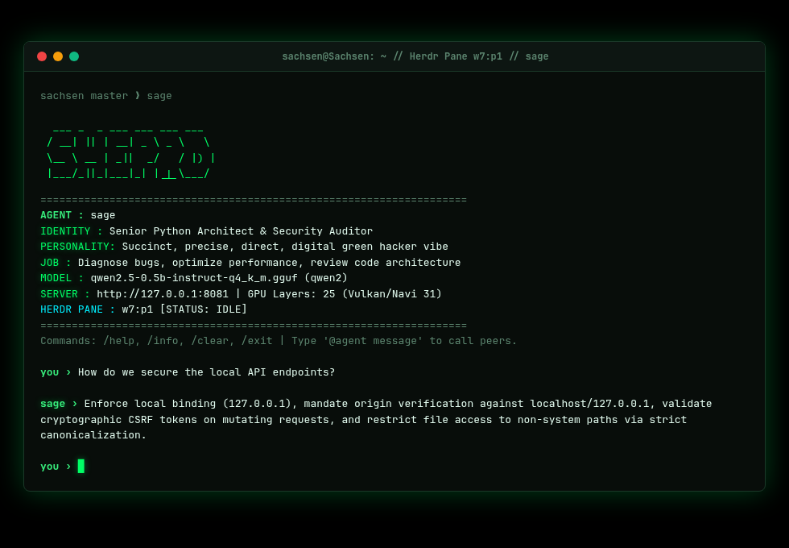
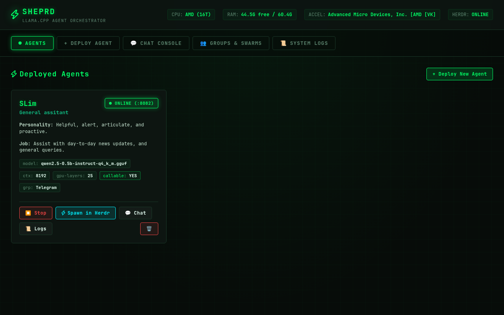

# ⚡ Sheprd: llama.cpp Agent Orchestrator & Herdr Integration

> **Terminal & web orchestrator for deploying local llama.cpp models, spinning up specialized AI agents, and seamlessly spawning them inside Herdr terminal workspaces and Telegram.**

[](https://www.python.org/)
[](https://opensource.org/licenses/MIT)
[](https://github.com/ggml-org/llama.cpp)
[](https://github.com/herdr/herdr)

---

## 🖥️ Screenshots

### Web UI Dashboard & Agent Fleet


### Digital Green Interactive Terminal Chat (Herdr Integration)


### Model Auto-Inspector & Hardware Tuning Wizard


---

## 🚀 One-Step Linux Installation

Sheprd provides an automated setup script that configures an isolated environment, automatically resolves Python dependencies across all major Linux distributions (Ubuntu, Debian, Fedora, Arch, openSUSE, Alpine), downloads the pre-built `llama.cpp` Vulkan acceleration bundle, and registers the `sheprd` CLI in `~/.local/bin`.

### Option 1: Quick Install (Git Clone)

```bash
git clone https://github.com/saxonmurray85-ops/sheprd.git
cd sheprd
chmod +x install.sh
./install.sh
```

The installer automatically handles PEP 668 managed environments (Ubuntu 24.04+, Debian 12+, Fedora, Arch) using an isolated virtual environment and configures `~/.local/bin` in your shell startup configuration.

### Option 2: Python Package (pip)

```bash
cd sheprd
pip install -e .
```

### Uninstallation

To completely remove Sheprd, run:
```bash
./uninstall.sh
```

---

## ⚡ Quick Start

### 1. Download a Curated Starter Model

Sheprd includes a built-in streaming model downloader that automatically verifies GGUF headers:

```bash
sheprd download qwen2.5-0.5b
```

Available curated starter models:
- `qwen2.5-0.5b` (469 MB) — Ultra-fast, lightweight general assistant & testing
- `smollm2-135m` (98 MB) — Ultra-compact test model
- `llama-3.2-1b` (1.3 GB) — Compact meta model
- `qwen2.5-coder-1.5b` (1.1 GB) — Specialized coding agent

> [!TIP]
> **Recommended Models for Autonomous Tool Calling:**
> While compact models (<1.5B) run fast on low-spec hardware, reliable tool calling (invoking weather, search, calculations, and MCP plugins) requires models with **3B+ parameters** tuned for instruction following and function calling (such as `Qwen2.5-3B-Instruct`, `Llama-3.2-3B-Instruct`, `Mistral-7B-Instruct`, or `Qwen2.5-Coder-7B`). Models below 1.5B often lack the structural adherence to reliably generate valid JSON tool calls.

### 2. Inspect Any GGUF Model

Sheprd reads binary headers in milliseconds to determine layer count, context length, architecture, and optimal GPU offload:

```bash
sheprd inspect ~/.local/share/sheprd/models/qwen2.5-0.5b-instruct-q4_k_m.gguf
```

### 3. Launch the Web UI

```bash
sheprd web
# Or: sheprd ui
```
Navigate to: **`http://127.0.0.1:8765`**

### 4. Chat Inside Herdr Terminal

Once an agent is deployed (e.g. `sage`), launch it in Herdr by typing its name in any terminal pane:

```bash
sage
```
Or trigger automatic tab creation from the CLI or Web UI:
```bash
sheprd spawn sage
```

---

## 🧠 Key Features

### 1. Pure-Python GGUF Auto-Inspection
- Reads GGUF v2/v3 binary structures without third-party dependencies.
- Extracts architecture (`llama`, `qwen2`, `mistral`, `gemma`, `phi3`), quantization format, layer count, context window size, and chat template strings.

### 2. Hardware-Aware Optimal Configuration
- Automatically calculates CPU physical/logical threads and detects discrete GPUs (AMD Radeon RX 7900 XTX via Vulkan, NVIDIA via CUDA).
- Calculates the optimal `--n-gpu-layers` based on available VRAM and parameter sizes.
- Prevents resource exhaustion by sizing batch sizes and context memory to physical limits.

### 3. Native Herdr Workspace Integration
- **CLI Executable**: Automatically creates an executable launcher at `~/.local/bin/<agent_name>`.
- **Typing the Agent Name**: In any Herdr pane, typing `<agent_name>` instantly connects to the local llama-server, streams responses in real-time, and manages Herdr pane titles and status indicators (`working` / `idle`).
- **One-Click Tab Spawning**: Web UI and CLI communicate over Herdr's Unix domain socket (`~/.config/herdr/herdr.sock`) using `herdr tab create --label <name>` and `herdr pane run`.

### 4. Telegram Bot Support
- Connect any agent directly to a Telegram bot by providing your bot token in the Web UI or CLI.
- Asynchronous polling worker dispatches incoming messages with system persona prompts and returns formatted markdown.
- Token scrubbing and chat allowlists (`SHEPRD_TELEGRAM_ALLOWED_USERS`) ensure secure remote interaction.

### 5. Multi-Agent Swarms & Callable Permissions
- **`callable_by_agents` (True/False)**: Enforces boundary controls. Private agents cannot be summoned by peer agents.
- **Group Swarms**: Tag agents into groups (`dev`, `research`, `triage`). Send broadcast prompts to execute tasks across all agents in the group.
- **Peer Delegation**: Call `@agent_name` inside interactive chat to route sub-prompts directly to specialized agents.
- **Agent-Hub Synchronization**: Automatically syncs agent metadata with `~/.agent-hub/data/memory.db` for multi-tool discovery.

### 6. Tools & Skills Ecosystem (Core + MCP Hub)
Sheprd equips your local agents with live autonomous tool execution using standard OpenAI function calling format supported natively by `llama-server`:

- **⚡ Built-in Core Tools (Zero-Setup & Zero-Dependency)**:
  - 🌦️ **`get_weather`**: Real-time live weather conditions, temperature, humidity, and wind via `wttr.in`.
  - 📖 **`wikipedia_search`**: Fact lookups, article summaries, and related topics via Wikipedia REST API.
  - 🌐 **`fetch_url`**: Read and extract clean text from public web documentation or articles.
  - 🧮 **`calculate`**: Safe AST-based mathematical expression evaluator (arithmetic, trigonometry, logarithms, roots).
  - ⏱️ **`get_current_time`**: Live UTC time, system local timezone, and UNIX timestamps.
- **🔌 Model Context Protocol (MCP) Client & 1-Click Smithery Hub**:
  - **1-Click Smithery & Registry Install**: Paste any Smithery tool URL (e.g. `https://smithery.ai/server/@smithery-ai/fetch`), package identifier (`@smithery-ai/...`), or terminal command. Sheprd automatically parses, installs, and connects it.
  - **Zero-Config Popular App Store**: 1-click zero-setup additions directly from the Web UI for **Web Page Fetcher** (`uvx mcp-server-fetch`), **SQLite Database Inspector** (`uvx mcp-server-sqlite`), **Memory Graph** (`npx -y @modelcontextprotocol/server-memory`), **Git Inspector** (`uvx mcp-server-git`), **Local Filesystem**, and **Brave Search**.
  - **Seamless Bi-directional Claude & Cursor Sync**: Any tool installed via Smithery Web (*"Install with Claude"*) or `smithery install --client claude` automatically synchronizes into Sheprd in real time!
  - **Live Smithery Search**: Query over 100K+ Smithery MCP tools directly from the Web UI or CLI.
  - Available across Web Chat, Herdr interactive terminal, and Telegram bots.
  - Automatic tool selection, iterative execution loops, and error recovery.

### 7. Dynamic LRU Model Hot-Swapping
Running multiple local LLM servers simultaneously quickly exhausts GPU VRAM and system memory. Sheprd includes an intelligent Least-Recently-Used (LRU) model hot-swapping engine:
- **Zero-Friction Activation**: When an agent is called (via Web Chat, Herdr terminal `sheprd spawn`, `@mention`, or Telegram), Sheprd ensures its server is active.
- **Configurable VRAM Ceiling (`SHEPRD_MAX_ACTIVE_MODELS`)**: By default, Sheprd keeps `1` active model loaded in VRAM (perfect for single-GPU or shared systems). When a new agent is invoked, the least-recently-used server is automatically stopped and evicted before the new model loads.
- **Multi-GPU Scalability**: Set `export SHEPRD_MAX_ACTIVE_MODELS=3` (or any integer) to support multiple concurrent active models on larger rigs.

---

## 🔒 Hardened Security Model

Sheprd implements defense-in-depth across all system boundaries:

| Control | Implementation |
|---|---|
| **Path Traversal Guard** | Canonical resolution via `os.path.realpath`. Rejects system paths (`/etc`, `/proc`, `/sys`, `/root`) and user credential stores (`~/.ssh`, `~/.gnupg`, `secrets.env`). |
| **SSRF & Network Shield** | `fetch_url` verifies DNS resolutions and enforces strict IP-level rejection of RFC-1918 private subnets (`10.0.0.0/8`, `172.16.0.0/12`, `192.168.0.0/16`), loopback (`127.0.0.0/8`), and cloud metadata services (`169.254.169.254`), with recursive redirect tracking and a 64KB download ceiling. |
| **AST Exponent Bomb Guard** | Math evaluator rejects malicious nesting and caps exponents (`abs(exp) <= 100`, `abs(base) <= 10000`), neutralizing algorithmic complexity attacks like `9**9**9`. |
| **GGUF Binary Validation** | Verifies `b'GGUF'` magic bytes before launching any binary process. |
| **Subprocess Isolation** | Executes `llama-server` strictly via `list[str]` arguments (no `shell=True`, no bash string interpolation). |
| **CSRF & API Token Defense** | Enforces Origin validation and unconditional `X-Sheprd-Token` checking for state-changing HTTP endpoints. API token persisted to `~/.local/share/sheprd/api_token` with `0600` permissions. |
| **PID Verification Guard** | Inspects `/proc/{pid}/cmdline` before sending termination signals to verify the target process is actually `llama-server`. |
| **Strict File Permissions** | SQLite database and WAL files are maintained at `0600` (user read/write only). |
| **Token Scrubbing** | Telegram tokens and MCP environment secrets are masked in API responses (`••••`) and scrubbed from all server logs. |
| **Localhost Binding** | Servers and Web UI bind exclusively to `127.0.0.1`. |

---

## 🏗️ Architecture

```
                                  ┌───────────────────────────────┐
                                  │   Sheprd Web UI (aiohttp)     │
                                  │   http://127.0.0.1:8765       │
                                  └───────────────┬───────────────┘
                                                  │
                      ┌───────────────────────────┼──────────────────────────┐
                      │                           │                          │
                      ▼                           ▼                          ▼
            ┌───────────────────┐       ┌───────────────────┐      ┌───────────────────┐
            │ GGUF Inspector    │       │ Server Manager    │      │ Telegram Workers  │
            │ & Auto-Config     │       │ (llama-server)    │      │ (Async Polling)   │
            └───────────────────┘       └─────────┬─────────┘      └─────────┬─────────┘
                                                  │                          │
                                                  ▼                          ▼
                                        ┌───────────────────┐      ┌───────────────────┐
                                        │ Local llama-server│◄─────┤ Telegram Chat     │
                                        │ Port 8081..8999   │      └─────────┬─────────┘
                                        └─────────▲─────────┘                │
                                                  │                          │
                      ┌───────────────────────────┴──────────────────────────┴┐
                      │                                                       │
                      ▼                                                       ▼
            ┌───────────────────┐                                   ┌───────────────────┐
            │ Herdr Integration │                                   │ Tool Hub & MCP    │
            │ ~/.local/bin/name │                                   │ JSON-RPC Client   │
            │ herdr.sock API    │                                   │ 🌦️ 📖 🧮 🔌 💾     │
            └───────────────────┘                                   └───────────────────┘
```

---

## ⌨️ CLI Reference

| Command | Description |
|---|---|
| `sheprd web [--port 8765]` | Launch the Digital Green Web UI & background services |
| `sheprd list` | List all configured agents, ports, and statuses |
| `sheprd inspect <path>` | Auto-inspect GGUF file and display hardware recommendations |
| `sheprd download [model_key]` | Download starter models with progress indicator |
| `sheprd start <name>` | Start the llama-server and Telegram bot for an agent |
| `sheprd activate <name>` | Hot-swap/load agent model into memory (LRU eviction if at limit) |
| `sheprd stop <name>` | Stop an agent's server process |
| `sheprd stop-all` | Stop all active agent servers |
| `sheprd spawn <name>` | Spawn agent in an active Herdr terminal tab |
| `sheprd chat <name>` | Launch interactive Digital Green terminal chat with live tool execution |
| `sheprd tools` | Display the system-wide catalog of Core and MCP tools |
| `sheprd mcp list` | List registered external MCP servers |
| `sheprd mcp install <target>` | 1-click install from Smithery URL, package identifier, or command |
| `sheprd mcp sync` | Synchronize MCP servers from Claude Desktop and Cursor configs |
| `sheprd mcp search <query>` | Search the Smithery 100K+ tool registry |
| `sheprd mcp add <name> <cmd> [args...]` | Register and connect a new stdio MCP server manually |
| `sheprd mcp remove <name>` | Disconnect and remove an MCP server |
| `sheprd telegram status` | Check connectivity status of all configured Telegram bots |
| `sheprd telegram run` | Run foreground standalone Telegram bot worker |
| `sheprd logs <name>` | View recent server logs |
| `sheprd remove <name>` | Delete an agent and uninstall its Herdr launcher |

---

## ⚙️ Environment Variables

| Variable | Default | Description |
|---|---|---|
| `SHEPRD_MAX_ACTIVE_MODELS` | `1` | Maximum concurrent `llama-server` instances kept loaded in RAM/VRAM. When exceeded, the least recently used model is automatically stopped. Increase this on multi-GPU setups. |
| `SHEPRD_TELEGRAM_ALLOWED_USERS` | *(none / open)* | Comma-separated list of allowed Telegram usernames or user IDs (e.g. `user1,12345678`). Restricts remote bot access. |
| `SHEPRD_HOME` | `~/.local/share/sheprd` | Root directory for Sheprd databases, logs, binaries, and lockfiles. |

---

## 🧪 Testing

Sheprd includes a comprehensive unit test suite covering security guards, GGUF binary extraction, database persistence, group validation, and multi-agent loops:

```bash
python3 -m unittest tests/test_sheprd.py -v
```

---

## 📄 License

MIT License. Designed and built for seamless pairing with Herdr and local open-source LLMs.
